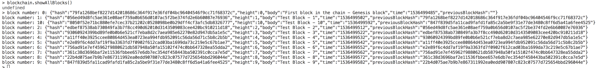

# Blockchain Data

Blockchain has the potential to change the way that the world approaches data. Project 2 Develops Blockchain skills by understanding the data model behind Blockchain, and by developing your own simplified private blockchain, where levelDB is used to persist the blockchian dataset using the level Node.js library.

Udacity provided boilerplate code that basically implements a class containing all attributes of a block, and a class that implements all functionality that interacts with the blocks and blockchain. Udacity also provided a file called: levelSandbox.js where it demonstrates the Data Access Layer.

All code for this project is in one file: simpleChain.js and it also includes the Data Access Layer fucntions. 

The basic implemented blockchain function are:

  + `addBlock(newBlock)`: Adds a new block to the chain.

  + `getBlockHeight()`: Counts all the blocks in the chain.

  + `getBlock(blockHeight)`: Gets a block and returns it as a JSON striong object

  + `validateBlock(blockHeight)`: Validates the block data integrity

  + `validateChain()`: Validates if the blockchain is still valid at any moment

Optionally `Promises` are used to represent the completion of asynchronous operations. 

# Attributes of block
the hash is generated by the SHA256 algorithm

`const SHA256 = require('crypto-js/sha256');`


``` javascript
class Block{
	constructor(data){
     this.hash = "",
     this.height = 0,
     this.body = data,
     this.time = 0,
     this.previousBlockHash = ""
    }
}
```
# Configure LevelDB to persist dataset
``` javascript
const level = require('level');
const chainDB = './chaindata';
const db = level(chainDB);
```

# Modify the simpleChain.js functions to persist data with levelDB

## Modify `addBlock(newBlock)` to store a new block within LevelDB.

Get the current height of the blockchain.

``` javascript
        let height = parseInt(await this.getBlockHeight())`
```
Assign time, hash and height in the newBlock object.
``` javascript
        newBlock.time = new Date().getTime().toString().slice(0, -3);
        newBlock.hash = SHA256(JSON.stringify(newBlock)).toString();
        newBlock.height = height + 1;
```
In case the current height is > -1 then assign the current hash to the previousblock hash of the newBlock
``` javascript
        if (height > -1) {
          let previousBlock = await this.getBlock(height);
          newBlock.previousBlock = previousBlock.hash;
        }
```
Finally persist the data in LevelDB
``` javascript
        this.addDataToLevelDB(newBlock.height, JSON.stringify(newBlock))
``` 

## Persist the genesis block in the blockchain
Test if the blockchain is empty, if so call addBlock and create the genesis block (part of constructor)
``` javascript
        this.getBlockHeight().then(function (height) {
            if (height === -1) {
                _self.addBlock(new Block("First block in the chain - Genesis block"));
                console.log('The Genesis block is created!');
            } 
```

# Modify validate functions
The validateChain function calls the validateBlock function and checks in LevelDB if a block is still valid. 

The integrety is checked for each block in the chain
```javascript
      for (var i = 0; i < height; i++) {
          // validate block
          if (!this.validateBlock(i))errorLog.push(i);
          // compare blocks hash link
          let blockHash = this.chain[i].hash;
          let previousHash = this.chain[i+1].previousBlockHash;
          if (blockHash!==previousHash) {
            errorLog.push(i);
          }
      }
```
The errors are pushed into an errorLog if the integrity is violated. 

# Modify `getBlock()` function
The db.get function inside Promise
``` javascript
      return new Promise((resolve, reject) => {
          db.get(key, (err, value) => {
            if (err) {
              reject(err)
            }
            resolve(value)
          })
      })
```

# Modify `getBlockHeight()` function
Read the entire datastream and increment 1 to the blockHeigth
``` javascript
      return new Promise((resolve, reject) => {
            //initialize heigth at -1
            let height = -1;
            db.createReadStream().on('data', (data) => {
               height = height + 1;
            }).on('error', (error) => {
               reject(error)
            }).on('close', () => {
               resolve(height);
            })
      })
```
# test code

1. Open terminal and type `node`

2. In the node session, type `.load simpleChain.js`

3. Initialise a blockchain object `let blockchain = new Blockchain()`

4. Use a loop function to add 10 blocks to the chain. the loop creates one block every 10 seconds.
``` javascript
    (function theLoop (i) {
      setTimeout(function () {
        let blockTest = new Block("Test Block - " + (i + 1));
            blockchain.addBlock(blockTest).then((result) => {
            console.log(result);
            i++;
            if (i < 10) theLoop(i);
        });
      }, 10000);
    })(0);
  
  ```

5. Validate the blockchain to check for chain consistency

    + ```blockchain.validateChain()```

6. The function `showAllBlocks` lists all blocks the chain

    + ``` blockchain.showAllBlocks()```




